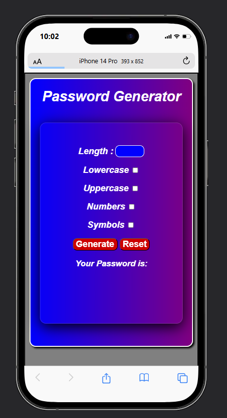
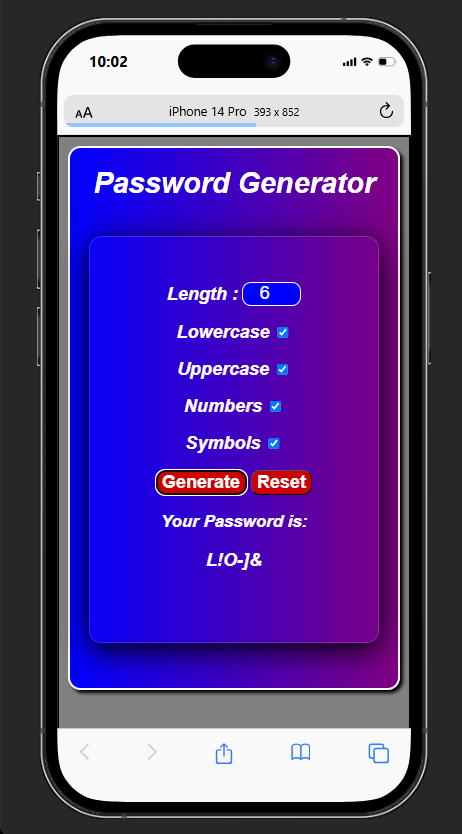
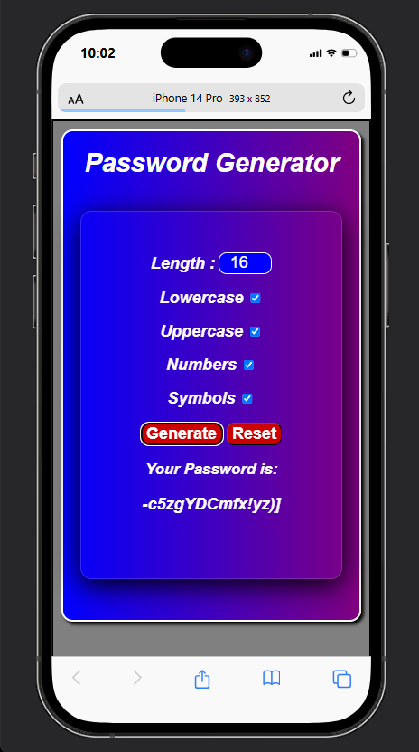
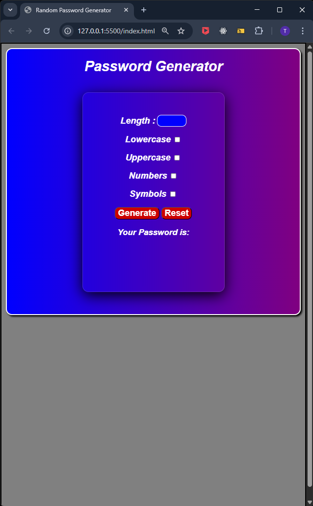
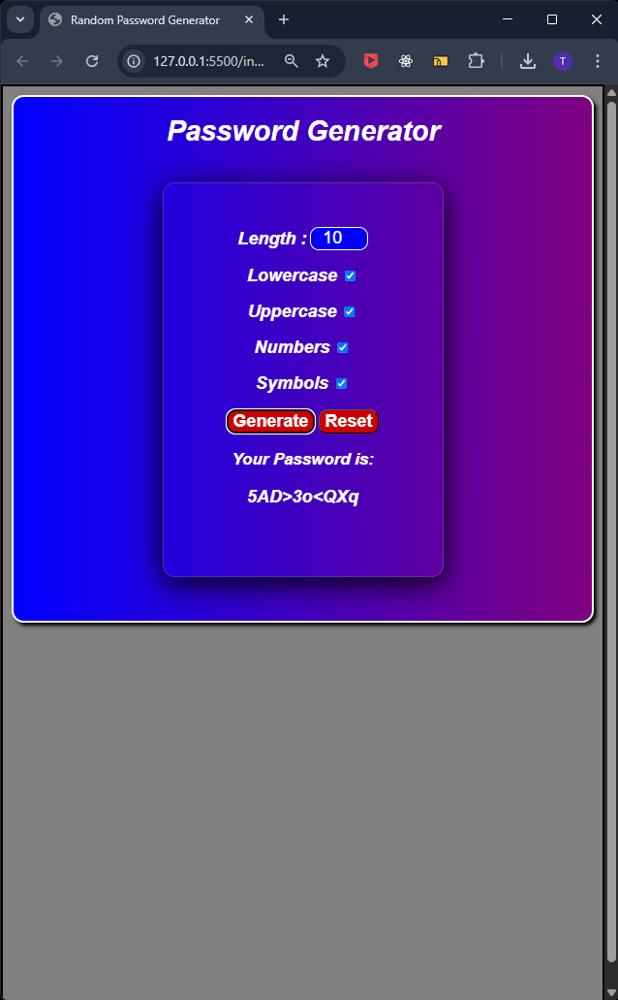

# 🔐 Random Password Generator

A sleek, browser-based password generator built with **HTML**, **CSS**, and **JavaScript**. Users can customize password length and choose whether to include lowercase letters, uppercase letters, numbers, and symbols. The app ensures password strength and flexibility with a clean UI.

## 🚀 Features

- Set password length (minimum 4 characters)
- Choose to include:
  - ✅ Lowercase letters
  - ✅ Uppercase letters
  - ✅ Numbers
  - ✅ Symbols
- Instant password generation
- Stylish responsive design with blur effects and gradients
- Input validation and helpful feedback messages

## 📸 Preview

## 🛠️ Technologies Used

- HTML5
- CSS3 (flexbox, gradients, blur effects)
- JavaScript (DOM manipulation, logic)

Open index.html in your browser.

✏️ Customization Tips
You can adjust the color scheme in style.css.

Modify the character set in index.js to include or exclude certain characters.

⚠️ Notes
Minimum password length is 4.

At least one character type must be selected.

This app runs entirely in the browser — no data is stored or sent anywhere.

📄 License
This project is licensed under the MIT License — feel free to use, modify, and share!

## 📇 Author

**Tshepang Oliver**  
Frontend Developer   
- 🔗 [GitHub](https://github.com/T5H3P4N9)  
- 🔗 [LinkedIn](https://www.linkedin.com/in/tshepang-oliver-3a5540205/)
- 📧 [Email](mailto:olivertshepang@gmail.com)

